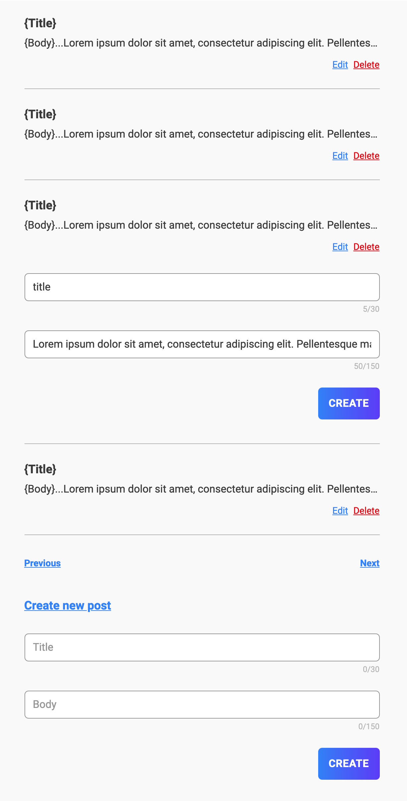

# Influencer Challenge

El Challenge consiste en listar Blog Posts desde un GraphQL API.

## Tech Stack

- ReactJS
- Typescript
- GraphQL
- Styles: se puede utilizar pure CSS o cualquier libraria que te ayude a maquetar (TailwindCSS, Bootstrap, etc)

## UI/UX

No se necesita que sea pixel-perfect pero el layout tiene que ser igual a lo siguiente:

## TODO:

1. Crear el maquetado como se muestra en el ejemplo
1. Utilizar la siguiente API para listar Posts: `https://graphqlzero.almansi.me/#example-top`

- Mostrar maximo 10 posts
- Agregar paginacion (previous & next)
  - Previous button solo se muestra en la pagina 2 en adelante
  - Next solo se muestra desde la primera pagina hasta la penultima (ultima pagina no lo renderiza)
- `Edit` renderiza un formulario para hacer cambios. Utilizar la misma API para editar.
- `Delete` elimina el post utilizando la misma API

1. `Create new post` renderiza un formulario (mismo al edit) para agregar un Post nuevo. Se utiliza la misma API
